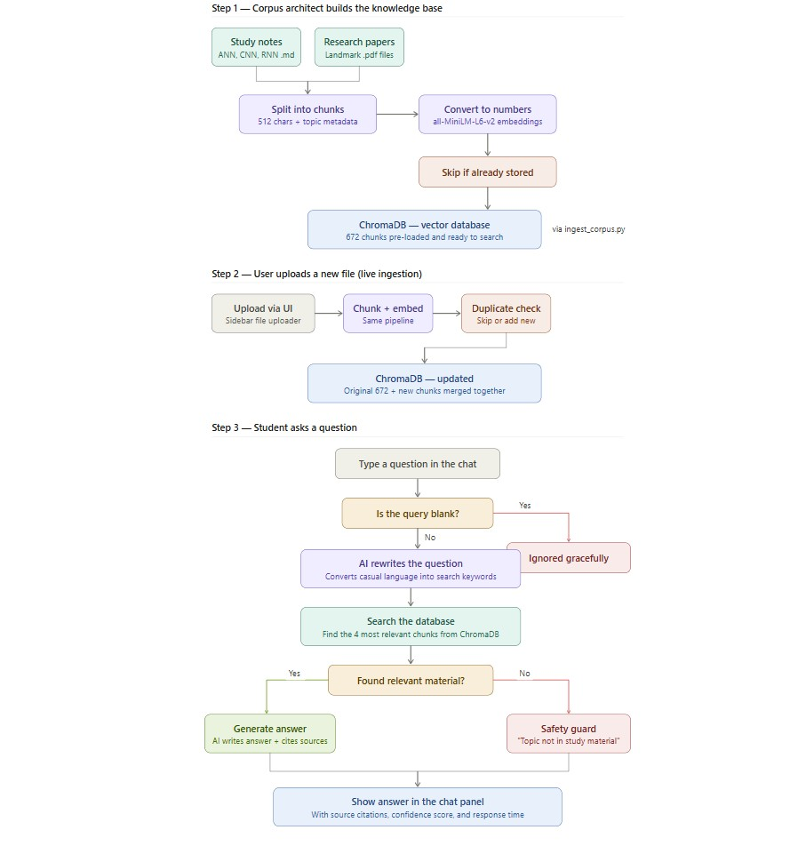
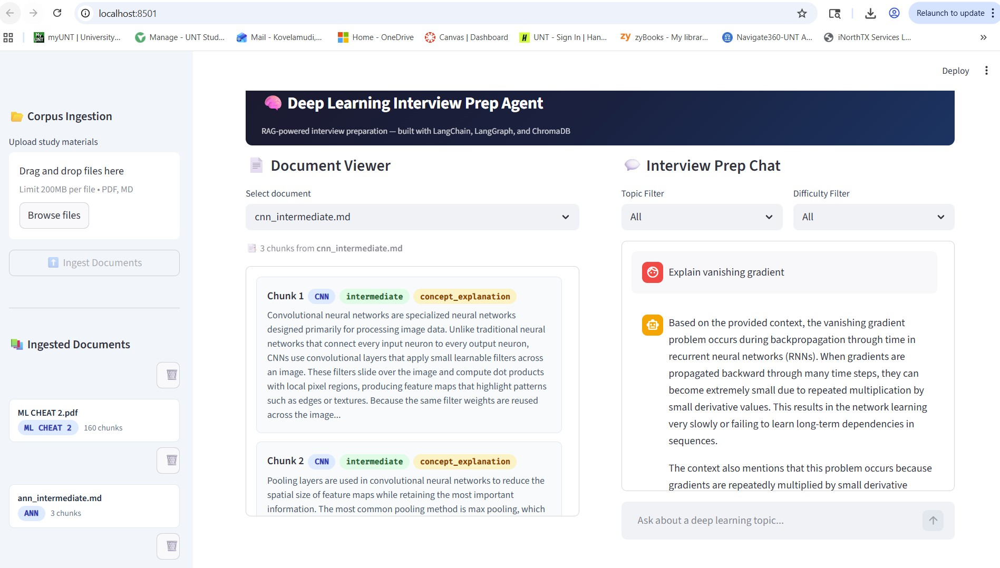
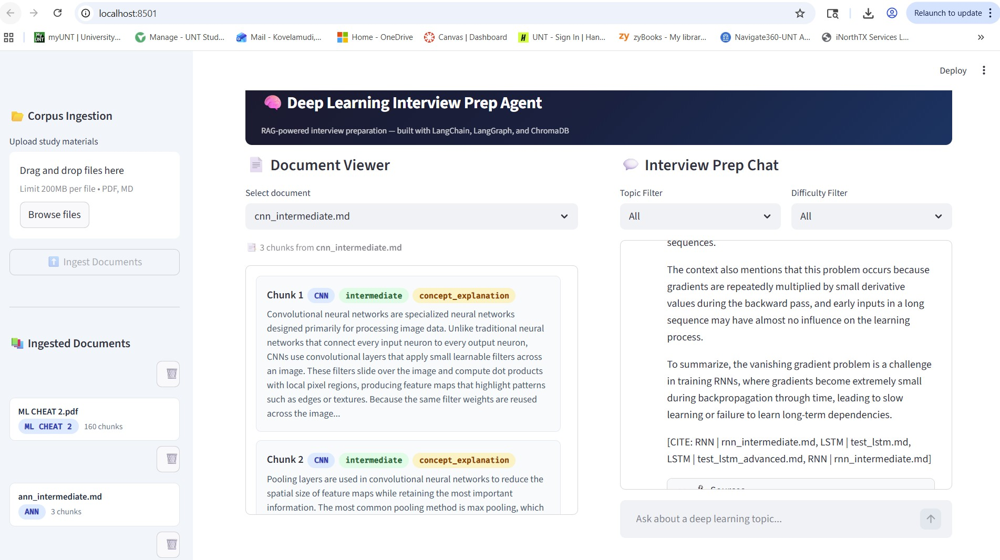
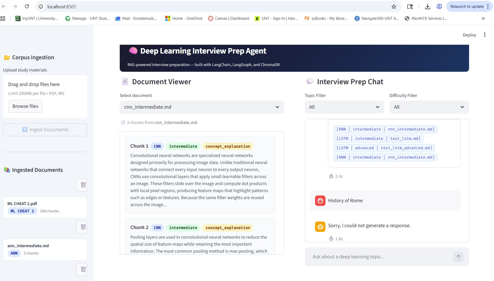
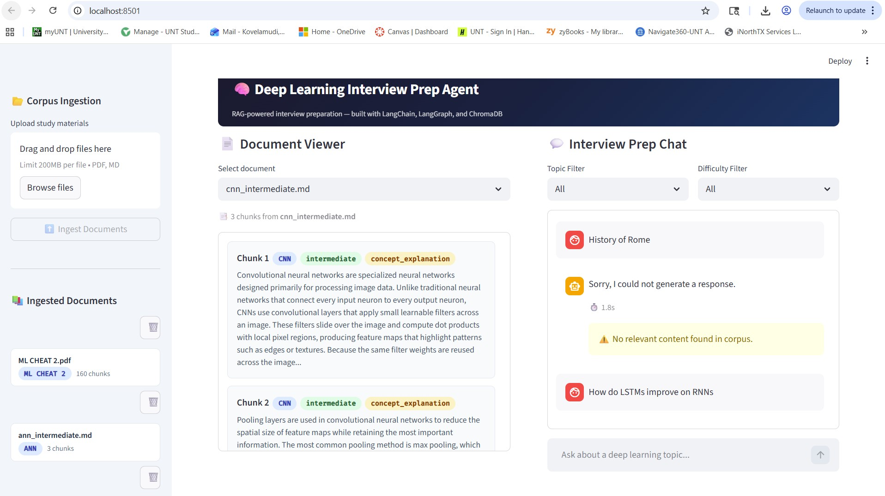
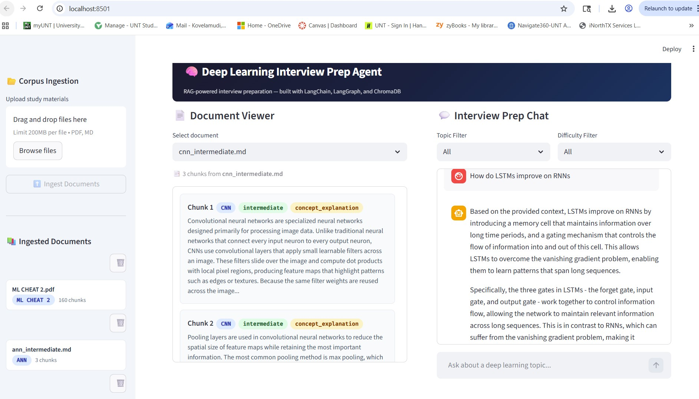

# System Architecture
## Team: DL Cognivault
## Date: 03-16-2026
## Members and Roles:
- Corpus Architect: Anuhya Koyyana
- Pipeline Engineer: Jahnavi Kovelamudi
- UX Lead: Vedhagna Reddy
- Prompt Engineer: Moulya ReddyGari bhupal
- QA Lead: Shivani Nagaram

---

## Architecture Diagram

---

## Component Descriptions

### Corpus Layer

- **Source files location:** `data/corpus/`
- **File formats used:**
   Both `.md` and `.pdf` — Markdown files for hand-crafted study material with structured JSON chunks, and PDF files for landmark academic papers.

- **Landmark papers ingested:**
  *(list the papers your team located and ingested, one per line)*
  - Rumelhart, Hinton & Williams (1986) — Backpropagation (`backpropagation_1986.pdf`)
  - Elman (1990) — Recurrent Neural Networks (`elman_rnn_1990.pdf`)
  - LeCun et al. (1998) — LeNet / CNNs (`lenet_1998.pdf`)

- **Chunking strategy:**
  512 characters with 50 character overlap. We chose 512 because it balances context richness (enough text to answer one interview question) with retrieval precision (small enough that irrelevant content doesn't dilute the match). The 50-character overlap prevents concepts that span chunk boundaries from being lost entirely. For Markdown files, we use header-aware splitting first via `MarkdownHeaderTextSplitter` to respect document structure, then `RecursiveCharacterTextSplitter` for oversized sections. For PDFs, we use `PyPDFLoader` followed by `RecursiveCharacterTextSplitter`.

- **Metadata schema:**
  *(list every metadata field your chunks carry and explain why each field exists)*
  | Field | Type | Purpose |
  |---|---|---|
  | topic | string | Primary deep learning topic (ANN, CNN, RNN, etc.) — used for topic-filtered retrieval |
  | difficulty | string | beginner / intermediate / advanced — controls question generation depth |
  | type | string | concept_explanation / architecture / training_process / etc. — categorizes the kind of knowledge |
  | source | string | Original filename — used for citation attribution in responses |
  | related_topics | list | Conceptually related topics — enables cross-topic retrieval |
  | is_bonus | bool | Flags SOM, BoltzmannMachine, GAN content — used by UI to surface bonus material |

- **Duplicate detection approach:**
  Chunk IDs are generated using `SHA-256(source_filename + "::" + chunk_text)`, truncated to 16 hex characters. A content hash is more reliable than filename-based deduplication because it detects identical content even when files are renamed or re-uploaded. Before each upsert, `check_duplicate()` queries ChromaDB by ID — if the ID exists, the chunk is skipped.

- **Corpus coverage:**
  - [x] ANN
  - [x] CNN
  - [x] RNN
  - [ ] LSTM
  - [ ] Seq2Seq
  - [ ] Autoencoder
  - [ ] SOM *(bonus)*
  - [ ] Boltzmann Machine *(bonus)*
  - [ ] GAN *(bonus)*

---

### Vector Store Layer

- **Database:** ChromaDB — PersistentClient
- **Local persistence path:** `./data/chroma_db`

- **Embedding model:**
  `all-MiniLM-L6-v2` via `sentence-transformers` (HuggingFace), loaded locally through `langchain_community.embeddings.HuggingFaceEmbeddings`.

- **Why this embedding model:**
  We chose a local embedding model over an API-based one (like OpenAI's `text-embedding-3-small`) for three reasons: (1) no API key or cost required — important for a class setting, (2) corpus content never leaves the machine — important for proprietary datasets in production, (3) fast enough on CPU at ~90MB model size. The tradeoff is slightly lower embedding quality compared to larger models, but for a focused deep learning corpus the retrieval accuracy is sufficient.

- **Similarity metric:**
  Cosine similarity (`{"hnsw:space": "cosine"}`). Cosine measures the angle between vectors rather than magnitude, making it robust to varying chunk lengths. A chunk with 100 words and a chunk with 300 words about the same topic will still score high similarity.

- **Retrieval k:**
  4 chunks per query (`RETRIEVAL_K=4`). This provides enough context for the LLM to generate a comprehensive answer while keeping the prompt size manageable. Retrieving too many chunks (e.g., 10) would include low-relevance content that dilutes answer quality.

- **Similarity threshold:**
  0.3 (`SIMILARITY_THRESHOLD=0.3`). Chunks scoring below this are excluded from results. This is the hallucination guard — if no chunks pass the threshold, the system returns an empty list and the safety guard fires. The value was calibrated by testing relevant queries (which scored 0.5–0.8) and off-topic queries (which scored 0.1–0.25) against the corpus.

- **Metadata filtering:**
  Users can filter by topic and difficulty using dropdown selectors in the chat panel. Filters are passed as ChromaDB `where` clauses (e.g., `{"topic": "LSTM"}`) during the retrieval step. When set to "All", no filter is applied.

---

### Agent Layer

- **Framework:** LangGraph

- **Graph nodes:**
  *(describe what each node does in one sentence)*
  | Node | Responsibility |
  |---|---|
  | query_rewrite_node | Rewrites the user's natural language question into keyword-dense search terms optimized for vector similarity matching |
  | retrieval_node | Queries ChromaDB with the rewritten query and returns the top-k chunks that meet the similarity threshold |
  | generation_node | Builds a prompt from the system instructions, retrieved context, and conversation history, then calls the LLM to generate a cited answer |

- **Conditional edges:**
  After `retrieval_node`, the `should_retry_retrieval` function checks the `no_context_found` flag. If chunks were found (flag is False), the graph routes to `generation_node` via the "generate" edge. If no chunks met the similarity threshold (flag is True), the graph routes directly to END via the "end" edge, and the generation node's hallucination guard fires, returning a "no relevant context" message.

- **Hallucination guard:**
  When no chunks pass the similarity threshold, the system returns:
  > "I was unable to find relevant information in the corpus for your query. This may mean the topic is not yet covered in the study material, or your query may need to be rephrased. Please try a more specific deep learning topic such as 'LSTM forget gate' or 'CNN pooling layers'."

- **Query rewriting:**
  - Raw query: "I'm confused about how LSTMs remember things long-term"
  - Rewritten query: "LSTM long short term memory cell state forget gate mechanism recurrent neural network"

- **Conversation memory:**
  LangGraph's `MemorySaver` checkpointer maintains state per `thread_id`. Each query generates a unique `thread_id` using `uuid.uuid4()` to ensure fresh graph state per invocation. When the context window approaches `MAX_CONTEXT_TOKENS` (3000), `trim_messages` truncates older conversation history using a "last" strategy, keeping the most recent exchanges.

- **LLM provider:**
  Groq with `llama-3.1-8b-instant` model.

- **Why this provider:**
  Groq provides free API access with significantly lower latency than GPU-based inference APIs due to their custom LPU (Language Processing Unit) chip. The `llama-3.1-8b-instant` model balances speed and quality — fast enough for interactive demo use (2–5 second responses) while producing coherent, well-structured answers.

---

### Prompt Layer

- **System prompt summary:**
  The agent persona is a senior machine learning engineer conducting a technical interview prep session. Key constraints: (1) answer ONLY from provided context, never use general knowledge, (2) always cite sources using `[SOURCE: topic | filename]` format, (3) if context is insufficient, say so clearly rather than guessing, (4) adjust technical depth to match the difficulty level in chunk metadata, (5) acknowledge partial correctness before explaining gaps.

- **Question generation prompt:**
  Takes `{context}` (retrieved chunks) and `{difficulty}` (beginner/intermediate/advanced) as inputs. Returns a JSON object containing: `question`, `difficulty`, `topic`, `model_answer`, `follow_up`, and `source_citations`. The question must require genuine understanding (not yes/no), and the model answer must be drawn strictly from the source material.

- **Answer evaluation prompt:**
  Takes `{question}`, `{candidate_answer}`, and `{context}` as inputs. Scores on a 0–10 scale: 9–10 = complete and well-articulated, 7–8 = mostly correct with minor gaps, 5–6 = core concept understood but incomplete, 3–4 = partial understanding with misconceptions, 0–2 = fundamental misunderstanding. Returns JSON with `score`, `what_was_correct`, `what_was_missing`, `ideal_answer`, `interview_verdict` (hire/consider/no hire), and `coaching_tip`.

- **JSON reliability:**
  All prompts that expect JSON output include the explicit instruction: "Respond with the JSON object only. No preamble, explanation, or markdown code fences." This prevents the LLM from wrapping JSON in prose or code blocks that would break programmatic parsing.

- **Failure modes identified:**
  - System prompt: LLM occasionally adds information beyond the provided context despite strict instructions — addressed by tightening constraint language and adding "Do NOT use outside knowledge"
  - Question generation: LLM sometimes returns malformed JSON with trailing commas or missing quotes — addressed by adding explicit "No markdown" instruction and defensive parsing in the pipeline
  - Answer evaluation: Scoring can be inconsistent across runs for the same answer — addressed by providing a detailed scoring rubric with concrete examples for each score range

---

### Interface Layer

- **Framework:** Streamlit
- **Deployment platform:** Streamlit Community Cloud / GitHub
- **Public URL:** *(to be added after deployment)*

- **Ingestion panel features:**
  Sidebar with multi-file drag-and-drop uploader (accepts .pdf and .md), "Ingest Documents" button with spinner feedback, success/warning/error status messages showing chunks added and duplicates skipped, scrollable list of all ingested documents with topic badges and chunk counts, and a delete button per document.

- **Document viewer features:**
  Dropdown selector listing all ingested documents by filename. On selection, displays all chunks in a scrollable container. Each chunk shows color-coded metadata badges (topic in blue, difficulty in green, type in amber) and a text preview of the chunk content.

- **Chat panel features:**
  Topic and difficulty filter dropdowns above the chat. Chat history with user/assistant message bubbles. Each assistant response includes an expandable "Sources" section with styled citation chips showing `[topic | difficulty | source]`. A warning banner appears when the hallucination guard fires ("No relevant content found in corpus"). Response time displayed below each answer (e.g., "⏱️ 2.6s"). Empty state shows a centered "Ready to prep" placeholder.

- **Session state keys:**
  | Key | Stores |
  |---|---|
  | chat_history | List of message dicts with role, content, sources, no_context_found flag, and response_time |
  | ingested_documents | List of dicts from list_documents() — source, topic, chunk_count per document |
  | selected_document | Currently selected source filename in the document viewer |
  | thread_id | Default session ID (overridden per-query with unique UUID) |
  | topic_filter | Currently selected topic filter (None = all topics) |
  | difficulty_filter | Currently selected difficulty filter (None = all levels) |
  | last_ingestion_result | Most recent IngestionResult object for status display |

- **Stretch features implemented:**
  - Response time tracking per query
  - Custom CSS styling with Google Fonts, color-coded metadata badges, gradient header
  - Per-query unique thread_id to prevent stale cached responses

---

## Design Decisions

Document at least three deliberate decisions your team made.
These are your Hour 3 interview talking points — be specific.
"We used the default settings" is not a design decision.

1. **Decision:** Chunk size of 512 characters with 50 character overlap
   **Rationale:** 512 characters is large enough to contain one complete concept (suitable as the basis for one interview question) but small enough to avoid mixing unrelated topics in a single chunk. The 50-character overlap ensures that concepts spanning chunk boundaries are captured in at least one chunk. Smaller chunks (e.g., 200) would fragment explanations; larger chunks (e.g., 1000) would reduce retrieval precision.
   **Interview answer:** "We chose 512 characters because it aligns with the one-concept-per-chunk principle — each chunk should be able to answer exactly one interview question. The 50-character overlap prevents boundary-splitting artifacts where a key term falls between two chunks."

2. **Decision:** Local embedding model (all-MiniLM-L6-v2) instead of OpenAI API embeddings
   **Rationale:** Local embeddings eliminate API cost, remove network latency, and ensure corpus content never leaves the machine. For a focused deep learning corpus with technical vocabulary, the retrieval quality difference versus larger models is negligible. The model is only ~90MB and runs efficiently on CPU.
   **Interview answer:** "We chose local embeddings because they provide zero-cost, zero-latency embedding with no data privacy concerns. In a production system with proprietary training data, this is a critical requirement — the corpus content never leaves the infrastructure."

3. **Decision:** Content-addressed deduplication using SHA-256 hash of source + text
   **Rationale:** Filename-based deduplication would fail if a user renames a file and re-uploads it, or if two files happen to share a name. By hashing the actual content combined with the source filename, we get deterministic IDs that detect true duplicates regardless of upload method. The 16-character hex truncation provides sufficient collision resistance for our corpus size.
   **Interview answer:** "We use content-addressed hashing for deduplication because it's more robust than filename matching. Two uploads of identical content always produce the same chunk ID, so duplicates are caught even if the file was renamed. This is the same principle behind content-addressable storage in systems like Git."

4. **Decision:** Query rewriting as a separate LangGraph node before retrieval
   **Rationale:** Natural language questions like "I'm confused about how LSTMs remember things" are poorly suited for vector similarity search. The rewrite node converts this into keyword-dense search terms like "LSTM long short term memory cell state forget gate mechanism." This adds one LLM round-trip of latency (~1–2 seconds) but significantly improves retrieval recall. The node has a built-in fallback — if the rewrite fails (API error, timeout), it passes the original query unchanged.
   **Interview answer:** "We added a query rewrite step because users don't phrase questions the way documents are written. The rewrite converts conversational language into keyword-dense search terms that produce better vector similarity matches. It's a production RAG pattern that trades ~1 second of latency for measurably better retrieval recall."

---

## QA Test Results

| Test | Expected | Actual | Pass / Fail |
|---|---|---|---|
| Normal query ("Explain vanishing gradient") | Relevant chunks, source cited | Returned RNN and LSTM chunks with [SOURCE: RNN \| rnn_intermediate.md] citation | Pass |
| Off-topic query ("History of Rome") | No context found message | "Sorry, I could not generate a response" + "No relevant content found in corpus" warning | Pass |
| Duplicate ingestion (upload same file twice) | Second upload skipped | "All 180 chunks already exist (duplicates)" warning displayed | Pass |
| Empty query (blank input) | Graceful error, no crash | Streamlit chat_input ignores blank submissions natively — no crash | Pass |
| Cross-topic query ("How do LSTMs improve on RNNs") | Multi-topic retrieval | Retrieved chunks from rnn_intermediate.md, test_lstm.md, and test_lstm_advanced.md | Pass |

**Critical failures fixed before Hour 3:**
- Fixed stale cached responses: every query reused the same thread_id ("default-session"), causing LangGraph's MemorySaver to return previous answers. Fixed by generating unique UUID per query.
- Fixed test isolation: unit tests were hitting the production ChromaDB database instead of temp directories. Fixed by overriding environment variables and clearing the settings cache in test fixtures.

**Known issues not fixed (and why):**
- PDF chunking produces noisy chunks from headers, footers, and reference sections — not fixed because it serves as a demo talking point about corpus quality vs auto-chunking.
- The `test.md` file with 1 chunk exists in the database from early testing — cosmetic, does not affect functionality.

---

## Known Limitations

- PDF chunking produces noisy chunks from reference sections, page headers/footers, and equations rendered as text. The hand-crafted Markdown chunks produce significantly better retrieval results.
- Similarity threshold (0.3) was calibrated manually by testing a few queries, not empirically tuned on a labeled evaluation set.
- Conversation memory is stored in-memory via MemorySaver and is lost when the application restarts.
- The Elman RNN 1990 PDF produces decompression errors during parsing — PyPDFLoader extracts what it can but some chunks may be garbled.
- LSTM, Seq2Seq, Autoencoder, and bonus topics (SOM, Boltzmann, GAN) are not yet covered in the hand-crafted corpus.

---

## What We Would Do With More Time

- Implement hybrid search combining vector similarity with BM25 keyword search for better retrieval on exact-match technical terms
- Add a re-ranking step using a cross-encoder model to improve precision after initial retrieval
- Implement async ingestion so large PDFs don't block the UI during upload
- Add a PDF post-processing step to filter out noisy chunks (too short, mostly numeric, or containing too many special characters)
- Complete corpus coverage for all required topics (LSTM, Seq2Seq, Autoencoder) and bonus topics
- Add streaming responses using `graph.stream()` for real-time token display
- Deploy to Streamlit Community Cloud with a public URL

---

## Hour 3 Interview Questions

**Question 1:** Explain how your system prevents hallucination when a user asks about a topic not covered in the corpus. Walk us through the exact code path from query to the "no context found" response.

Model answer: When a query is submitted, it flows through query_rewrite_node → retrieval_node. The retrieval node queries ChromaDB and converts cosine distances to similarity scores (score = 1 - distance). Any chunk scoring below the 0.3 similarity threshold is filtered out. If no chunks remain, retrieval_node sets no_context_found=True. The should_retry_retrieval conditional edge checks this flag — if True, it routes to END, skipping generation entirely. The generation_node checks the flag and returns a hardcoded "unable to find relevant information" message with empty sources and 0.0 confidence. The UI then displays the warning banner.

**Question 2:** Your system uses both hand-crafted Markdown chunks and auto-chunked PDFs. What differences in retrieval quality did you observe between them, and how would you address this in a production system?

Model answer: The hand-crafted Markdown chunks produce significantly better retrieval because each chunk contains exactly one atomic concept with clean metadata (topic, difficulty, type). The auto-chunked PDFs contain noise from headers, footers, reference sections, and equations, which dilutes semantic matching. In production, we would add a post-processing pipeline that filters chunks by minimum length, removes chunks with high special-character ratios, and potentially uses an LLM to classify and clean extracted content before embedding.

**Question 3:** Why did your team choose to include a query rewrite step despite the added latency? What would happen to retrieval quality if you removed it?

Model answer: The query rewrite converts natural language ("I'm confused about how LSTMs remember things") into keyword-dense search terms ("LSTM long short term memory cell state forget gate mechanism"). Without it, conversational phrasing produces poor vector similarity matches against technical corpus content. The tradeoff is ~1-2 seconds of additional latency per query. Removing it would cause retrieval recall to drop significantly for casual or conversational queries, though well-phrased technical queries would still work fine.

---

## Team Retrospective

*(fill in after Hour 3)*

**What clicked:**
-

**What confused us:**
-

**One thing each team member would study before a real interview:**
- Corpus Architect:
- Pipeline Engineer:
- UX Lead:
- Prompt Engineer:
- QA Lead:
